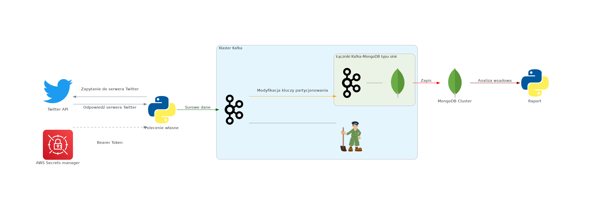
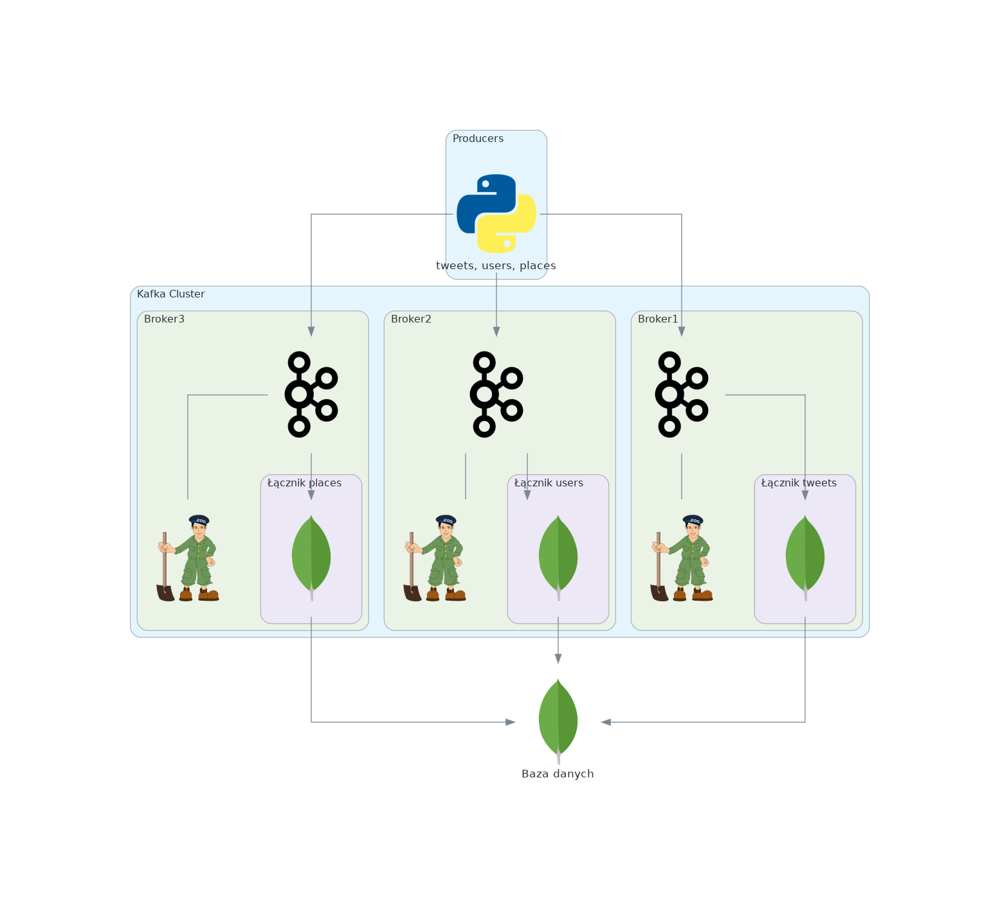
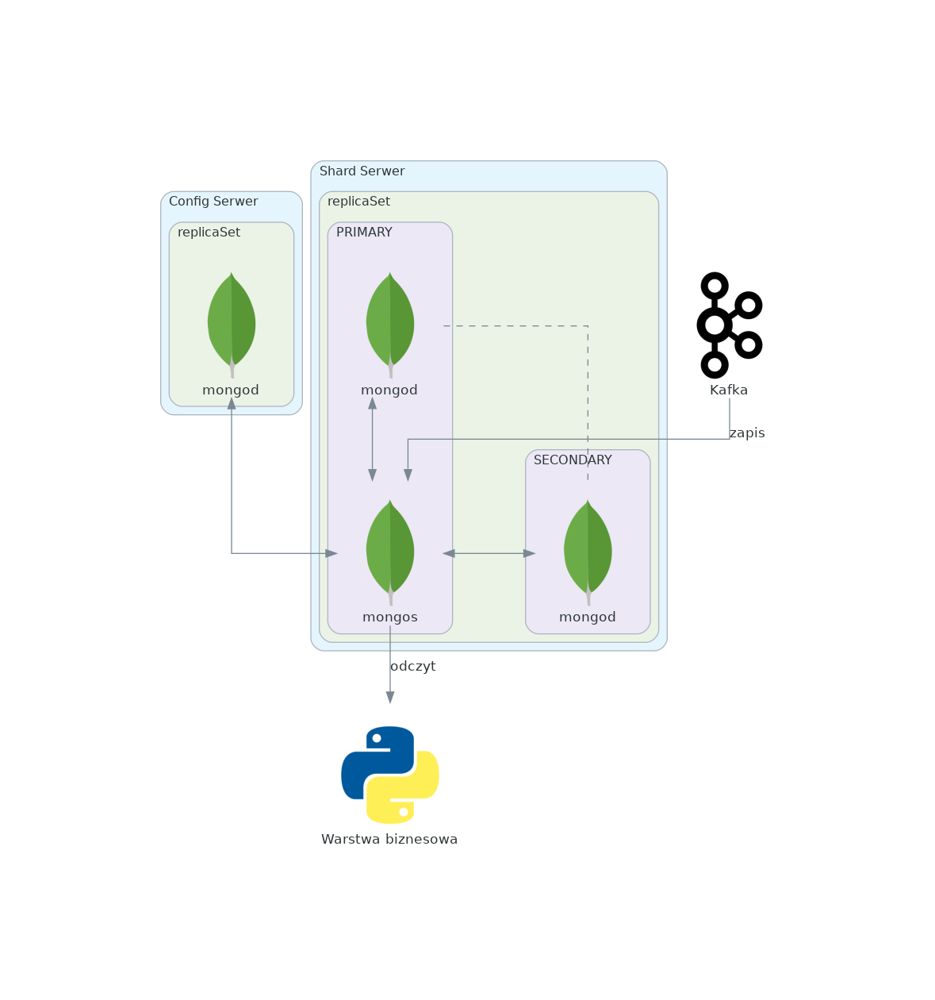

# WYNIKI I DYSKUSJA

Aby spełnić oczekiwania klienta zaproponowano dwa etapy wdrożeniowe.

1. Wdrożenie architektury pobierającej i przesyłającej dane aby zapisać je w bazie danych w celu wygenerowania raportu biznesowego "na żądanie".
2. Rozbudowanie architektury 1. o warstwę analityczną operującą na strumieniach danych.

W niniejszej pracy opisano głównie pierwszy etap wdrożeniowy z opisem proponowanych kroków niezbędnych do zrealizowania etapu drugiego.

Wszystkie skrytpy i dodatkowe informacje niezbędne do utworzenia systemu zostały zamiesznone w repozytorium GitHub pod adresem https://github.com/michkam89/bd-pw-project

## SCHEMAT ROZWIĄZANIA

Dane wykorzystywane w tej pracy pobierane są z serwisu Twitter poprzez udostępniony przez producenta interfejs programowania aplikacji (ang. *application programming interface* - API) (3), następnie przekazywane są w formacie JSON do klastra 3 maszyn z systemem `Apache Kafka` (4), gdzie wiadomości są tymczasowo zapisywane i kolejkowane a następnie strumienie danych są przesyłane poprzez tzw. *łączniki* do bazy danych `MongoDB` (5), skąd np. aplikacje typu *Business Intelligence* lub skrypty własne są w stanie pobierać, analizować i wizualizować dane.

W przypadku niniejszej pracy zaprezentowane zostaną przykładowe wyniki będące propozycją raportu napisanego w języku `Python` (6).

Wszystkie wymienione serwisy zostały utworzone na wirtualnych instancjach oferowanych przez serwis `AWS EC2` (ang. *Elastic Cloud Computing*) w chmurze `AWS`. Wszystkie instancje `EC2` utworzono we wspólnej grupie `IAM` umożliwiając im swobodną komunikację pomiędzy sobą w obrębie grupy. Zezwolono na nieograniczoną komunikację z *zewnętrzną* siecią internetową, natomiast do instancji z utworzonej grupy mogło połączyć się jedynie konto deweloperskie przy pomocy połączenia SSH posiadającego klucz autoryzacyjny.

Dodatkowo do przechowywania danych wrażliwych (tzw. *sekretów*) wykorzystano usługę `AWS Secrets Manager`, w której przechowano indywidualny klucz identyfikacyjny (tzw. *bearer token*) do API Twittera. Dodatkowo połączenie instancji EC2 komunikującej się z serwisem `AWS Secrets Manager` wymagało nadania instancji EC2 dodatkowej roli oraz skonfigurowania tzw. `AWS Endpoint` aby zapewnić bezpieczne połączenie.

Rycina 1 przedstawia ogólny schemat pierwszego etapu  wdrożenia zaprojektowanego systemu.
```{r general_scheme, echo=FALSE, out.width="110%", fig.align='center', fig.cap="Ogólny schemat użytego rozwiązania"}
library(reticulate)
use_condaenv(params$miniconda_env_name, required = TRUE)
source_python("figures/general_scheme2.py")

```

## POBIERANIE DANYCH ZE ŹRÓDŁA

W celu pobrania danych z serwisu Twitter, w języku `Python` napisany został skrypt `twitter_request.py`. Jego zadaniem jest 1. pobranie klucza identyfikacyjnego z serwisu `AWS Secrets Manager`, 2. wysłanie zapytania do modułu *recent* API Twitter'a, 3. wstępne rozdzielenie danych na 3 podzbiory oraz 4. utworzenia instancji *producenta* (ang. producer) `Kafka` i przesłanie danych do systemu `Kafka`.

Lista zależności niezbędna do odtworzenia środowiska w języku `Python` pozwalająca na wykonanie zapytania dostępna jest w pliku `twitter_api_requirements.txt`.

Zapytanie wymagało aby w treść wiadomości była w języku angielskim (filtr `lang:en`) oraz żeby w treści wiadomości pojawiły się znaczniki (tzw. hashtagi) `#war` oraz `#ukraine` lub `#russia`.

W przypadku udanego zapytania otrzymywane są 3 podzbiory danych w postaci zagnieżdżonej listy klucz-wartość:

1.  Podzbiór `data` zawiera metadane dotyczące pojedynczej wiadomości:

-   `id` unikalny klucz identyfikacyjny dla wiadomości
-   `author_id` unikalny klucz identyfikacyjny dla użytkownika Twittera
-   `created_at` czas i data utworzenia wiadomości
-   `text` treść wiadomości
-   `public_metrics` metryki wiadomości (np. liczba ponownych udostępnień czy ilość reakcji na wiadomość)
-   `geo` informacje geolokalizacyjne
-   `context_annotations` tematyczne zaklasyfikowanie wiadomości do kategorii utworzonych przez system Twitter

2.  Podzbiór `users` zawiera dane użytkownika:

-   `id` unikalny klucz identyfikacyjny dla użytkownika Twittera
-   `created_at` czas i data utworzenia konta w systemie (UTC?)
-   `description` opis danego użytkownika
-   `pinned_teet_id` klucz wiadomości, utworzonej przez użytkownika
-   `public_metrics` metryki danego konta (np. liczba osób śledząca dane konto)
-   `verified` informacja czy konto zostało uznane za zweryfikowane czy nie

3.  Podzbiór `places` zawiera dane lokalizacyjne:

-   `full_name` pełna nazwa lokalizacji
-   `country` nazwa kraju
-   `country_code` kod identyfikacyjny kraju
-   `geo` dane GPS
-   `name` nazwa lokalizacji
-   `place_type` typ lokalizacji

Zapytania są generowane w powtórzeniach z interwałami od 1s do 10s jak również ilość wiadomości pobieranych przy pojedynczym zapytaniu zawiera się w zakresie od 10 do 100. Losowy wybór interwału czasowego jak i ilość wiadomości został zastosowany w celu zbadania zachowania systemu w przypadku różnych poziomów obciążeń systemu. Losowość zapytań można dezaktywować przy użyciu flagi `randomize_request=False`.

## PRZETWARZANIE DANYCH

### Schemat Klastra Kafka

Dane pobrane przez skrypt `twitter_request.py` są następnie przesyłane do klastra 3 instancji EC2 z uruchomionymi procesami `Kafka`, stanowiące tzw. `brokery Kafka`. Zastosowanie 3 brokerów pozwoliło na rozproszony transfer danych oraz zastosowanie replikacji danych na poziomie 3 replik. Biorąc pod uwagę maksymalne obciążenie systemu do 300 zdarzeń na sekundę (3 podzbiory x 1s x 100 zdarzeń) użycie 3 brokerów na instancjach `t3.medium` wydaje się optymalnym zastosowaniem dla tej ilości danych. Użyta wersja `Kafki` wymaga również uruchomionego procesu `Zookeeper` koordynującego pracę brokerów `Kafka`. Zdarzenia przetwarzane przez `Kafkę` trafiają do bazy danych MongoDB. W trakcie przetwarzania modyfikowane są klucze zdarzeń by zoptymalizować przechowywanie danych w bazie (patrz [łączniki Kafka](#LK)). Schemat systemu `Kafka` został zaprezentowany na rycinie 2.

```{r kafka_scheme, echo=FALSE, out.width="60%", out.height="60%", fig.align='center', fig.cap="Schemat Klastra Kafka"}
library(reticulate)
use_condaenv(params$miniconda_env_name, required = TRUE)
source_python("figures/kafka_scheme2.py")

```

### Tematy Kafka

Na potrzeby analizy utworzono 3 tematy (ang. *topics*) nasłuchujące danych nieprzetworzonych: `tweets`, `users` oraz `places`.

Wszystkie tematy zostały utworzone z flagą `--replication-factor 3` oraz `--partitions 25`. Flaga `--replication-factor` odpowiada za poziom repilkacji danych i może być dostosowywana dla każdego z tematów osobno. Zastosowanie replikacji z wartością 3 powoduje że dane pobierane przez każdy temat będą replikowane na każdy z brokerów i zapewniają dostępność do danych przy awarii maksymalnie 2 maszyn. Z kolei flaga `--partitions` wskazuje na ile części zostanie podzielony temat w trakcie okresu przechowywania danych w systemie pomiędzy brokerami. Wartość 25 dla liczby partycji tematu została wybrana arbitralnie. Z uwagi na to, że w zaproponowanym rozwiązaniu istnieją 3 brokery, minimalna liczba partycji zapewniająca, że na każdym z nich znajduje się chociaż jedna partycja to 3. Przy obecnym ustawieniu można oczekiwać, że brokery będą mieć odpowiednio 8, 8 i 9 partycji każdego tematu oraz repliki partycji z pozostałych dwóch brokerów.

Dodatkowo, w celu zapewnienia równomiernego rozmieszczenia danych na partycjach zastosowano klucze partycjonowania tematów. Użycie takiego klucza powoduje, że zdarzenia z tym samym kluczem zawsze trafiają na tę samą partycję, co ułatwia określenie kolejności zdarzeń, ponieważ Kafka nie gwarantuje zachowania zdarzeń w kolejności pomiędzy partycjami. W tym przypadku jako klucze zastosowano klucz `author_id` dla tematu `tweets` oraz `id` odpowiednio dla tematów `users` i `places`. 

### Łączniki Kafka {#LK}

W celu przesłania danych z systemu `Kafka` do bazy danych `MongoDB` (patrz [PRZECHOWYWANIE DANYCH](#PD)) zastosowano łącznik typu *sink*. Zadaniem pojedynczego łącznika jest zbieranie zdarzeń przetworzonych przez strumień `Kafka` i przesłanie ich do docelowej bazy danych. Łączniki są stosowane zamiennie z konsumentami/producentami strumieni (wbudowane API `Kafka`) i ułatwiają integrację z aplikacjami dostarczającymi danych do `Kafki` jak i pobierającymi z niej dane bez konieczności ingerencji w kod źródłowy tych aplikacji.

W niniejszej pracy każdy z tematów przetwarzanych przez system `Kafa` posiada własny łącznik odpowiadający za transfer danych. Na potrzeby analizy każdy z 3 łączników jest osobnym procesem włączonym na osobnym brokerze `Kafka`. W przypadku łączników zdecydowano się na zaakceptowanie ryzyka związanego z tymczasową niedostępnością danych związaną z awarią i zastosowano łącznik typu *standalone*. W systemie produkcyjnym warto natomiast zastosować rozproszoną wersję łączników na maszynach oddzielonych od brokerów `Kafka`. 

Łączniki `Kafka` pozwalają modyfikować pojedyncze zdarzenia w tematach przy użyciu API SMT (ang. *Single Message Transforms*). Dzięki SMT możliwe są proste modyfikacje zdarzeń - zarówno kluczy jak i wartości. Jednak użycie nie jest zalecane do bardziej skomplikowanych modyfikacji danych. W obecnej pracy wykorzystano SMT do zdefiniowania odpowiedniego klucza wiadomości, który posłuży jako klucz partycjonowania w bazie MongoDB.

W przypadku tematu `tweets` kluczem w partycji `Kafka` jest pole `author_id`, a w bazie MongoDB korzystniejszym rozwiązaniem będzie zastosowanie klucza `id`, który jest unikalny, co pozwoli uniknąć duplikacji danych w bazie. Pole `id` nie znajduje się jednak w części zdarzenia zawierającej klucze, więc wymagało to użycia transformacji `ValueToKey` a następnie zmienić nazwę pola z `id` na `_id` wymagane przez MongoDB przy użyciu transformacji `ReplaceField$Key`.

Modyfikacje tematów `users` oraz `places` wymagały jedynie nadania kluczowi partycjonowania użytego w `Kafce` nazwy `_id` jako, że ten sam klucz zostanie użyty przy definiowaniu kolekcji w bazie MongoDB.

Poniżej zostały zamieszczone pliki konfiguracyjne łączników, wraz z zdefiniowanymi transformacjami SMT.

\small

-   `tweets`

```
name=mongo-sink-tweets
connector.class=com.mongodb.kafka.connect.MongoSinkConnector
connection.uri=mongodb://<ip instancji z mongos>:27017
database=twitter
collection=tweets
topics = tweets
max.num.retries=3
document.id.strategy.overwrite.existing=true

transforms=ValueToKey,RenameField
transforms.ValueToKey.type=org.apache.kafka.connect.transforms.ValueToKey
transforms.ValueToKey.fields=id
transforms.RenameField.type=org.apache.kafka.connect.transforms.ReplaceField$Key
transforms.RenameField.renames= "id:_id"
```
-   `users`

```
name=mongo-sink-users
connector.class=com.mongodb.kafka.connect.MongoSinkConnector
connection.uri=mongodb://<ip instancji z mongos>:27017
database=twitter
collection=users
topics = users
max.num.retries=3
document.id.strategy.overwrite.existing=true

transforms=HoistField
transforms.HoistField.type=org.apache.kafka.connect.transforms.HoistField$Key
transforms.HoistField.field=_id
```
-   `places`

```
name=mongo-sink-places
connector.class=com.mongodb.kafka.connect.MongoSinkConnector
connection.uri=mongodb://<ip instancji z mongos>:27017
database=twitter
collection=places
topics = places
max.num.retries=3
document.id.strategy.overwrite.existing=true

transforms=HoistField
transforms.HoistField.type=org.apache.kafka.connect.transforms.HoistField$Key
transforms.HoistField.field=_id
```

\normalsize

Dzięki zastosowaniu systemu `Kafka`, wiadomości które trafią do strumienia są przechowywane w systemie przez tydzień, co pozwala w łatwy sposób odzyskać dane, które nie zostały pobrane przez łączniki w czasie gdy były nieaktywne.

## PRZECHOWYWANIE DANYCH {#PD}

### Schemat bazy MongoDB


Na potrzeby długoterminowego przechowywania danych utworzono bazę danych MongoDB w klastrze z replikacją a jej schemat został zaprezentowany na rycinie 3. Skonfigurowano dwie repliki stanowiące pojedynczy `replicaSet` wchodzący w skład jednego tzw. "sharda". Konfiguracja w postaci pojedynczego "sharda" co prawda powoduje, że dane nie są rozpraszane na wiele instancji `MongoDB` (poza replikacją w obrębie `replicaSet` - na rycinie 3 replikacja zaznaczona przerywaną linią) ale zwiększają dostępność danych w przypadku gdy jedna z replik przestanie działać. 

Dodatkowo dodana została pojedyncza instancja serwera konfigurującego tzw. `config server`. Serwer ten przechowuje metadane o klastrze typu "sharded" - m.in. informacje o statusie danych oraz ich organizacji w klastrze. W systemach produkcyjnych rekomendowane jest zastosowanie replikacji równie dla `config servera` ponieważ w przypadku awarii kontroler `mongos` nie będzie w stanie odpowiednio obsłużyć zapytań z aplikacji zewnętrznych.

Dodatkowo na jednym z serwerów typu `shard` uruchomiony został proces `mongos` pełniący rolę kontrolera pomiędzy shardami i config serverem. To właśnie z procesem `mongos` łączą się aplikacje korzystające z danych z bazy MongoDB. Istnieją co najmniej trzy możliwości implementacji procesu `mongos`(7):

1. na instancjach razem z aplikacją korzystającą z bazy - ogranicza opóźnienie związane z wysyłaniem zapytań po sieci pomiędzy aplikacją a kontrolerem
2. na instancjach gospodarza typu primary (jak w przypadku tej pracy) - uniezależnia proces `mongos` od aplikacji, ale wprowadza ograniczenie w postaci pamięci - musi ona być dzielona pomiędzy procesem `mongod` 
3. na instancjach niezależnych - uniezależnia proces `mongos` od aplikacji i zwalnia pamięć dla procesu `mongod`

W obecnej pracy zastosowano podejście 2 jako że ilości danych i zużycie pamięci są niewielkie. 

```{r mongo_scheme, echo=FALSE, out.height="50%", fig.align='center', fig.cap="Schemat bazy MongoDB"}
library(reticulate)
use_condaenv(params$miniconda_env_name, required = TRUE)
source_python("figures/mongoDB_scheme.py")

```

### Szczegóły wdrożenia

W celu utworzenia serwera typu config użyto skryptu `setup_mongo_configsvr.sh`, który instaluje mongoDB, modyfikuje plik konfiguracyjny `mongod.conf` oraz inicjalizuje `replicaSet` o nazwie _"config"_. Poniżej zamieszczono przykładowy plik konfiguracyjny oraz kod inicjalizujący:

* Plik konfiguracyjny:

\small

```
storage:
  dbPath: /var/lib/mongodb
  journal:
    enabled: true
systemLog:
  destination: file
  logAppend: true
  path: /var/log/mongodb/mongod.log
net:
  port: 27019
  bindIp: 0.0.0.0
processManagement:
  timeZoneInfo: /usr/share/zoneinfo
replication:
  replSetName: config
sharding:
  clusterRole: configsvr

```

\normalsize

* Kod inicjalizujący `repicaSet` z jedną repliką:

\small
```
rs.initiate({
  _id: "config",
  configsvr: true,
  members: [{
    _id: 0,
    host: "<prywante ip instancji config>:27019"
  }]
})
```
\normalsize

W przypadku serwera typu shard użyto skryptu `setup_mongo_shardsvr.sh`, który również instaluje mongoDB i modyfikuje plik konfiguracyjny. Poniżej zamieszczono przykładowy plik konfiguracyjny (umiesczono tylko różnice w stosunku do config serwera) oraz kod inicjalizujący `replicaSet` dla pojedynczego serwera shard z dwoma replikami:

* Plik konfiguracyjny (różnice):

\small
```
net:
  port: 27018
  bindIp: 0.0.0.0
replication:
  replSetName: shard
sharding:
  clusterRole: shardsvr
```
\normalsize
* Kod inicjalizujący `replicaSet` (wykonywany tylko na jednym z serwerów):

\small
```
rs.initiate({
  _id: "shard",
  members: [
  {_id: 0, host: "<prywante ip instancji 1>:27018"},
  {_id: 1, host: "<prywante ip instancji 2>:27018"}]
})
```
\normalsize
Po inicjalizacji `replicaSet` dla serwerów typu shard, na jednej z instancji, w tle został uruchomiony proces `mongos` przy użyciu polecenia `mongos --configdb config/"<prywante ip instancji config>:27019" --bind_ip 0.0.0.0`

Kolejnym krokiem było zarejestrowanie sharda (dwóch replik) jako klaster oraz utworzenie bazy danych i kolekcji do przechowywania danych. 

Na instancji z aktywnym procesem `mongos` wykonano poniższe polecenia:

1. Rejestracja sharda
\small
```
mongo --port 27017 
sh.addShard('shard/<prywante ip instancji 1>:27018,<prywante ip instancji 2>:27018')
```
\normalsize
2. Utworzenie bazy i kolekcji

\small
```
mongo --port 27018 
use twitter 
db.createCollection('tweets')
db.createCollection('users')
db.createCollection('places')"
```
\normalsize
3. Rejestracja klucza partycjonowania danych po shardach (klucze oomówiono w sekcji `Łączniki Kafka`)

\small
```
mongo --port 27017 
sh.enableSharding('twitter')

sh.shardCollection('twitter.tweets', {_id : 1})
sh.shardCollection('twitter.users', {_id : 1})
sh.shardCollection('twitter.places', {_id : 1})
```
\normalsize


## WIZUALIZACJA DANYCH

### Analiza treści wiadomości

`<placeholder>`

### Analiza profilu użytkowników

`<placeholder>`
